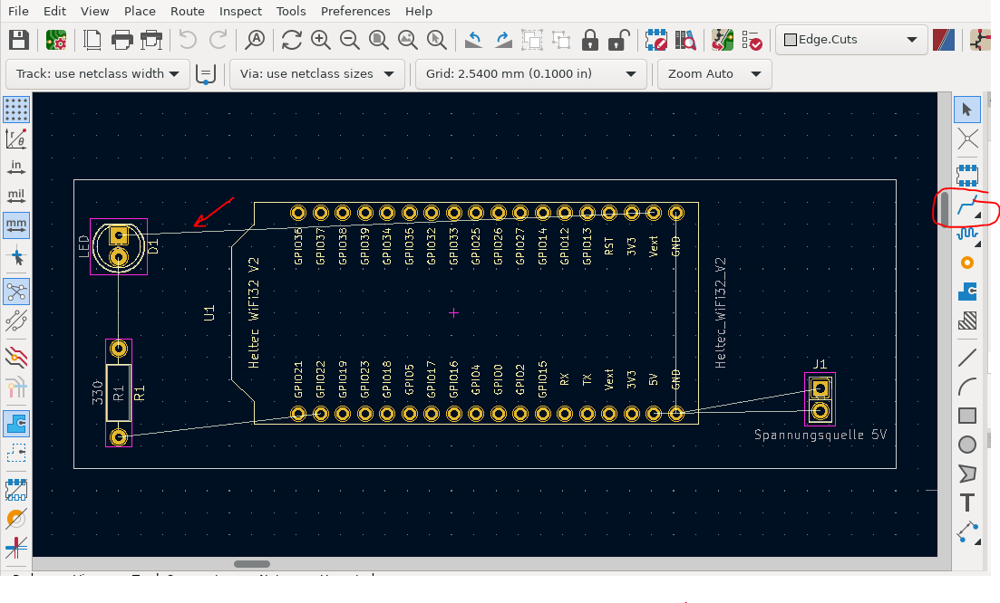

# GTA2023
## Bewaesserung
Hier sind die Quelldateien für das Projekt Bewässerung

## webSteuerung
Hier sind die Quelldateien mit der eine Websteuerung realisiert werden kann

## Uebung (KiCad) 
### KiCad herunterladen
- [KiCad 6.0.11 für Windows x64](https://downloads.kicad.org/kicad/windows/explore/stable/download/kicad-6.0.11-x86_64.exe)

### Herunterladen des Projektes
- Klickt auf den grünen Button "<> Code" und wählt "Download Zip" 
  - das ist das einfachste, auch wenn dabei die Bilder und die README mitkommen - das könnt ihr dann weglöschen, ihr braucht nur den Ordner "Uebung"

### mit KiCad bearbeiten
- "File" -> "Open project"
- Mit dem Button  kommt man zum Schaltplan. Den könnt ihr Euch ansehen und vielleicht (später) versuchen etwas zu ändern
- Mit dem Button  kommt ihr zur Leiterplatte

### Leiterplatte

- die Leiterbahnen sind dort noch nicht verlegt - das könnt ihr mal probieren
  - benutzt das eingekreiste Symbol und klickt an ein Ende einer Verbindungslinie (Pfeil)
  - dann könnt ihr die Leiterbahn bis zum anderen Ende der Verbindungslinie verlegen
  - mit der "Esc" - Taste verlasst ihr den "Verlegemodus", mit "Strg" + "z" macht ihr die letzten Aktionen rückgängig
- unter "View" -> "3D - Viewer" könnt ihr Euch das Ergebnis anschauen
